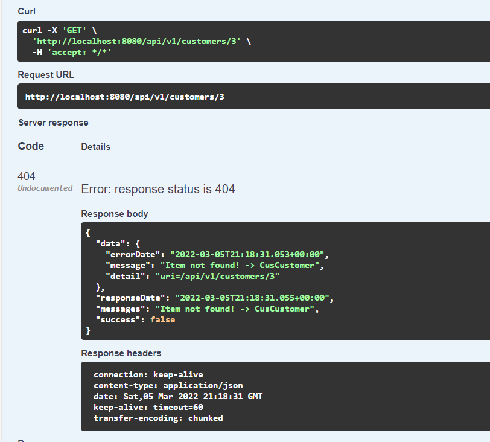

# Case4

Dersteki projemizde baseEntity içerisinde getByIdWithControl metodunda eğer ilgili id ile bir kayıt
bulunamazsa “Item not found!” hatası veriyoruz. Bu tüm entityler için aynı ve aynı hata mesajı veriliyor.
Bunun yerine;
"Item not found! -> CusCustomer" şeklinde hata vermesini sağlayınız.
## Not:
Exceptionlarda, GenErrorMessage da vs, genel yerlerde değişiklik yapmanız gerekebilir. 
